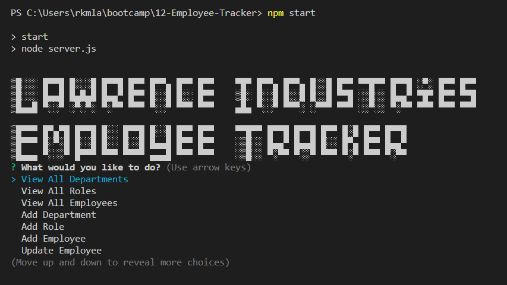
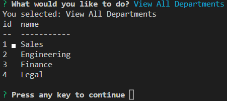
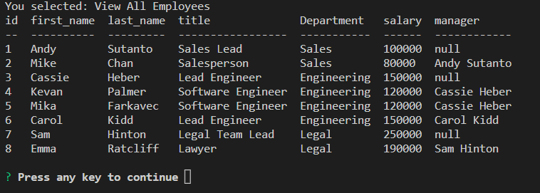

# 11-Employee-Tracker

   

  ## Description
 
This application was created help a business owner to view and manage their company's departments, roles & employees.

The business owner will be able to view the following:
- All departments with a table showing department names & department ids
- All roles with a table listing the job title, role id, the department to which the role belongs & the salary for that role
- All employees with a table showing employee IDS, first & last names, job titles, department, salaries & the manager to whome the employees reports

The business owner will be able to add the following information:
- Add a new department
- Add a new role with the role name, salary & department for that role
- Add a new employee with their first name, last name, role & manager 

The business owner will also be able to:
- Update an existing employee 
- Easily quit the application

Things I've learned:

- How to use mySQL, creating schema & seeding it
- How to create queries & joins 
- An awful lot of array mapping and using them in inquirer.prompts
- Using the 'when' in the Inquirer NPM library to create a press any key to continue for the user 
- Creating a clean quit from the application for the user 

 ## Table of Contents 
  - [Installation](#installation)
  - [Usage](#usage)
   - [License](#license)
   - [Contributing](#contributing)
   - [Test](#test)
   - [Questions](#questions)

  ## Installation

Please download the following files: server.js & package.json along with the db folder containing schema.sql & records.sql
Run "npm install" to create the package-lock.json & commence the application with the command "npm start"

  ## Usage

A walkthrough video is available! https://drive.google.com/file/d/1VSrTg-a_JIuGvDF6f8ACBDBVgVHMItfM/view 

The start of the application: 

The client can arrow up and down through the 8 choices to be made. For example, they can view all departments: 

And view all their employees:

A gif on how to use the application:  

  ## License

  Application is covered by the MIT License license 

  More information regarding said license can be found at https://choosealicense.com/licenses/mit
 

  ## Contributing 
  If you would like to contribute to this application, please reach out to me via one of the means listed under Questions.
  

  ## Test
A lot of testing was done in the MySQL shell! 

  ## Credits

My fellow coder-buddy: Cassandra Watson https://github.com/cassiewatsonn  
And The Ever Amazing Dominique Meeks Gombe!

  

## Questions
   Please contact me via one of the following methods: 
   
   * https://github.com/rkml14
   * rkmlawrence@gmail.com
